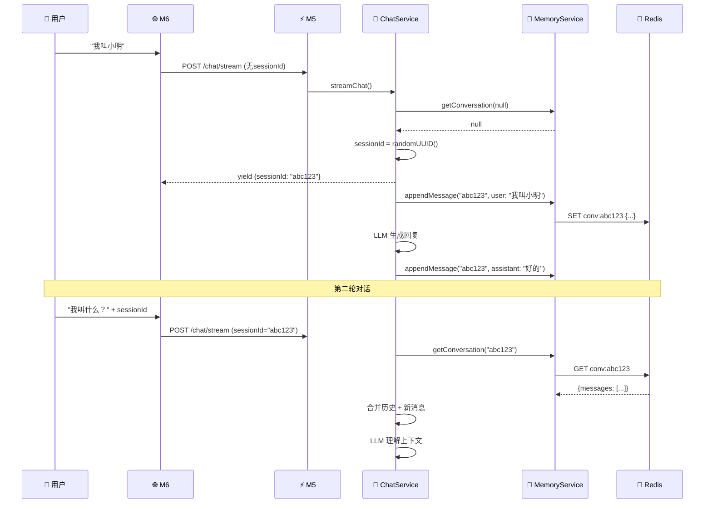

<!--
- [INPUT]: 依赖对 M6 模块和 LLM 会话管理的深入理解
- [OUTPUT]: M6 全栈验证模块技术详解 + LLM 上下文管理最佳实践
- [POS]: ai-fundamentals 的技术深度笔记
- [PROTOCOL]: 变更时更新此头部，然后检查 CLAUDE.md
-->

# M6 会话持久化与上下文管理深度解析

> **生成时间**: 2026-01-23  
> **讨论主题**: M6 全栈验证模块、Redis 会话持久化、LLM 上下文窗口管理策略  
> **GitHub Issue**: [#1 M6 会话持久化与上下文管理深度解析](https://github.com/exposir/ai-evolution-kit/issues/1)

---

## 一、M6 模块架构深度解析

### 核心定位

**M6: Fullstack Demo** — M5 可视化验证层，通过完整的图形界面验证 NestJS 后端的全部功能。

```
架构层次:
前端层: M4 (Next.js AI UX组件库) + M6 (全栈验证Demo)
    ↓
后端层: M5 (NestJS Server)
    ↓
基础设施: LLM Provider + Redis
```

### 四大功能标签页

| Tab                    | 功能         | 验证点                               |
| ---------------------- | ------------ | ------------------------------------ |
| 📊 **Dashboard**       | 服务状态总览 | M5健康检查、Redis连接、系统监控      |
| 💬 **Chat (Ch20)**     | 对话测试     | 流式传输、会话持久化、模式切换       |
| 🧠 **Memory (Ch21)**   | 会话记忆     | Redis持久化、上下文记忆、3步验证流程 |
| ⚡ **Throttle (Ch22)** | 限流测试     | 并发请求、429错误、限流恢复          |

### 关键技术创新：SSE 流式端点

**问题**: Next.js rewrite 会缓冲整个响应，破坏 SSE 流式特性

**解决**: 专用 Route Handler 直接透传 `response.body`

```typescript
// src/app/api/chat/stream/route.ts
export async function POST(request: NextRequest) {
  const body = await request.json();
  const response = await fetch(`${M5_URL}/chat/stream`, {
    method: "POST",
    body: JSON.stringify(body),
  });

  // 透传 SSE 流，不缓冲
  return new Response(response.body, {
    headers: {
      "Content-Type": "text/event-stream",
      "Cache-Control": "no-cache",
      Connection: "keep-alive",
    },
  });
}
```

**设计哲学**: 不与框架对抗，在恰当层次引入专用端点——选择正确的抽象层。

---

## 二、会话持久化实现详解

### Checkpointer 模式

```
持久化 = 状态快照 + 增量追加 + 恢复能力

核心三要素:
1. 唯一标识 (sessionId)
2. 状态序列化 (JSON)
3. 外部存储 (Redis)
```

### 完整数据流



### 核心代码实现

#### 1. 前端传递 sessionId

```typescript
// M6: src/app/page.tsx
const [sessionId, setSessionId] = useState<string | null>(null);

const handleChat = async (msg: string) => {
  const res = await fetch("/api/chat/stream", {
    method: "POST",
    body: JSON.stringify({
      messages: [{ role: "user", content: msg }],
      sessionId, // ← 首次为 null，后续传递
    }),
  });

  // SSE 流式读取
  for await (const line of readSSE(res.body)) {
    const data = JSON.parse(line);
    if (data.sessionId) {
      setSessionId(data.sessionId); // ← 保存到状态
    }
  }
};
```

#### 2. 后端加载历史

```typescript
// M5: chat.service.ts
async *streamChat(dto: ChatRequestDto) {
  const sessionId = dto.sessionId || randomUUID();
  yield { type: 'sessionId', data: sessionId };

  // 从 Redis 加载历史消息
  const history = await this.memoryService.getConversation(sessionId);
  const historyMessages = history?.messages || [];

  // 合并历史 + 新消息 → LLM 看到完整上下文！
  const allMessages = [...historyMessages, ...dto.messages];

  const result = streamText({
    model: this.openai(model),
    messages: allMessages,
  });
}
```

#### 3. Redis 存储结构

```json
// Redis Key: conv:abc123
{
  "sessionId": "abc123",
  "messages": [
    { "role": "user", "content": "我叫小明", "timestamp": 1737670000000 },
    {
      "role": "assistant",
      "content": "好的，记住了",
      "timestamp": 1737670002000
    }
  ],
  "createdAt": 1737670000000,
  "updatedAt": 1737670012000
}
```

```typescript
// M5: memory.service.ts
async appendMessage(sessionId: string, message: {...}) {
  let state = await this.getConversation(sessionId);

  if (!state) {
    state = {
      sessionId,
      messages: [],
      metadata: {},
      createdAt: Date.now(),
      updatedAt: Date.now(),
    };
  }

  state.messages.push({ ...message, timestamp: Date.now() });

  // 保存到 Redis，24小时 TTL
  await this.redis.setex(
    'conv:' + sessionId,
    60 * 60 * 24,
    JSON.stringify(state)
  );
}
```

### Redis vs PostgreSQL 对比

| 维度         | Redis                | PostgreSQL          |
| ------------ | -------------------- | ------------------- |
| **读取延迟** | **0.1-1ms** (内存)   | 5-50ms (磁盘+索引)  |
| **写入延迟** | 0.1-1ms              | 10-100ms (事务+WAL) |
| **TTL支持**  | **原生支持**         | 需定时任务清理      |
| **持久化**   | RDB/AOF可选          | **强一致性保证**    |
| **适用场景** | **临时会话** (< 24h) | 长期归档、数据分析  |

**设计哲学**:

- ✅ 用对的工具做对的事
- ✅ 关注点分离 —— 会话状态不是业务数据
- ✅ 简化即完美 —— 24小时过期 = 自动垃圾回收

---

## 三、上下文窗口管理

### 当前实现的致命问题

```typescript
// M5: chat.service.ts (L72)
const allMessages = [...historyMessages, ...newMessages];
// ❌ 无限制传递所有历史！
```

**后果**:
| 轮次 | 消息数 | Tokens (估算) | 成本 |
|------|--------|---------------|------|
| 10 | 20 | ~5,000 | $0.001 |
| 50 | 100 | ~25,000 | $0.005 |
| 100 | 200 | ~50,000 | **$0.01** |
| 1000 | 2000 | 500,000+ | **超出窗口！** |

### 业界标准方案

#### 方案 1: 滑动窗口（最常用）

```typescript
// ✅ 只保留最近 N 条消息
async chat(dto: ChatRequestDto) {
  const history = await this.memoryService.getConversation(sessionId);
  const historyMessages = history?.messages || [];

  // 只取最近 20 条
  const recentMessages = historyMessages.slice(-20);
  const allMessages = [...recentMessages, ...dto.messages];
}
```

#### 方案 2: Token 窗口（精确控制）

```typescript
import { encodingForModel } from "js-tiktoken";

const MAX_CONTEXT_TOKENS = 8000;
const enc = encodingForModel("gpt-4o");

let totalTokens = 0;
const selectedMessages = [];

for (let i = historyMessages.length - 1; i >= 0; i--) {
  const msgTokens = enc.encode(historyMessages[i].content).length;
  if (totalTokens + msgTokens > MAX_CONTEXT_TOKENS) break;

  selectedMessages.unshift(historyMessages[i]);
  totalTokens += msgTokens;
}
```

#### 方案 3: 摘要压缩（LangChain 方案）

```typescript
if (messages.length > 30) {
  const toCompress = messages.slice(0, 20);
  const recent = messages.slice(20);

  // 调用 LLM 生成摘要
  const summary = await generateText({
    model: this.openai("gpt-4o-mini"),
    messages: [
      { role: "system", content: "总结以下对话的关键信息" },
      ...toCompress,
    ],
  });

  messages = [
    { role: "system", content: `历史摘要: ${summary.text}` },
    ...recent,
  ];
}
```

#### 方案 4: 混合策略（生产级）

```typescript
function prepareContext(history: Message[]) {
  if (history.length <= 20) {
    return history; // 小对话，全传
  }

  // 保留关键信息（Attention Sink）
  const anchors = history.filter(
    (msg) =>
      msg.role === "system" || // 系统提示
      msg.metadata?.isUserCorrection || // 用户纠错
      msg.metadata?.containsIdentity, // 身份信息
  );

  // 最近消息
  const recent = history.slice(-20);

  // 去重合并
  return [...anchors, ...recent].filter(uniqueById);
}
```

### 主流应用的实现

| 应用        | 策略                  | 证据                    |
| ----------- | --------------------- | ----------------------- |
| **ChatGPT** | 滑动窗口 + 摘要       | UI提示 "部分消息已折叠" |
| **Claude**  | Attention Sink + 采样 | Anthropic 论文 (2024)   |
| **Gemini**  | 层次摘要 + KV Cache   | Google I/O 2024         |

**关键洞察**: 不是纯滑动窗口，而是混合策略 —— 既保留关键信息，又控制总量。

---

## 四、何时开新对话？

### 场景分类矩阵

| 场景类型       | 是否需要上下文 | 推荐策略     | 示例                  |
| -------------- | -------------- | ------------ | --------------------- |
| **独立查询**   | ❌ 不需要      | **新对话**   | "什么是 React？"      |
| **连续任务**   | ✅ 强依赖      | **同一对话** | 代码 Review、分析报告 |
| **个性化对话** | ✅ 需要记忆    | **长对话**   | 学习辅导、技术顾问    |
| **工具使用**   | ⚠️ 部分需要    | **混合策略** | 代码生成、翻译        |

### 应该新对话的场景

1. **独立的、无关联的查询**

   ```
   讨论完 Python → 突然问 React
   → ✅ 开新对话，避免干扰
   ```

2. **上下文会造成干扰**

   ```
   在讨论 Java 项目时问数据库优化
   → ✅ 开新对话，避免混淆
   ```

3. **重置 AI 的"状态"**
   ```
   AI 理解错了，多次纠正无效
   → ✅ 开新对话，清空错误上下文
   ```

### 应该同一对话的场景

1. **迭代式开发**

   ```
   "写登录组件" → "加验证" → "改 TS"
   → ✅ 必须同一对话
   ```

2. **深度技术分析**

   ```
   "分析代码" → "为什么有问题？" → "优化方案"
   → ✅ 需要上下文连贯
   ```

3. **个性化学习**
   ```
   "我是新手" → "学完 X 了" → "下一步？"
   → ✅ AI 记住学习进度
   ```

### 核心原则

> **不是"尽量开新对话"，而是"理解任务性质，选择合适策略"**

```python
def should_start_new_conversation(current_conv, new_query):
    # 话题完全无关
    if topic_similarity(current_conv, new_query) < 0.3:
        return True

    # 对话过长且非关键
    if len(current_conv) > 50 and not is_critical_context(new_query):
        return True

    # AI 理解出现偏差
    if user_corrected_multiple_times(current_conv):
        return True

    # 其他情况: 继续当前对话
    return False
```

---

## 五、M6 模块待优化问题

### 代码质量问题

| 问题         | 现象                       | 严重程度   |
| ------------ | -------------------------- | ---------- |
| **文件规模** | `page.tsx` 1295行，超标62% | SEVERE-003 |
| **组件耦合** | 4个Tab+主逻辑全在一个文件  | SEVERE-001 |

### 推荐重构

```
现有: src/app/page.tsx (1295行)

推荐:
src/app/
├── page.tsx (150行，只负责路由和状态)
└── components/
    ├── DashboardTab.tsx (220行)
    ├── ChatTab.tsx (210行)
    ├── MemoryTab.tsx (270行)
    └── ThrottleTab.tsx (180行)
```

### 上下文管理优化

```typescript
// 最小改动方案 (5行代码)
const recentMessages = historyMessages.slice(-20);
const allMessages = [...recentMessages, ...dto.messages];

// 可配置方案 (推荐)
// .env
MEMORY_MAX_MESSAGES = 50;
MEMORY_MAX_TOKENS = 8000;
```

---

## 六、核心要点总结

### 会话持久化

- ✅ Redis 是临时会话的最佳选择（快速、TTL、简化）
- ✅ PostgreSQL 用于长期归档和数据分析
- ✅ 用一句话说清楚：**每次对话前读历史，对话后追加记录**

### 上下文管理

- ❌ 不要无限制传递所有历史
- ✅ 滑动窗口是基础，混合策略是生产标准
- ✅ 保留关键信息 (Attention Sink) + 最近消息 (Rolling Window)

### 对话策略

- 不是"尽量开新对话"
- 不是"永远用同一对话"
- 而是**理解任务性质，选择合适策略**

### 设计哲学

> **"好的上下文管理 = 只传必要的，而不是全部的"**  
> **"好的工具选择 = 用对的工具做对的事"**  
> **"好的对话策略 = 逻辑完整的任务为一个对话"**

---

## 相关资源

- [M6 README](../../packages/06-fullstack-demo/README.md)
- [ChatService 实现](../../packages/05-server-core/src/chat/chat.service.ts)
- [MemoryService 实现](../../packages/05-server-core/src/memory/memory.service.ts)
