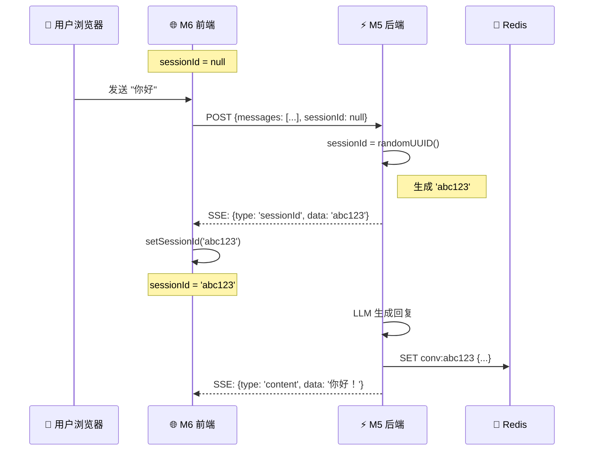
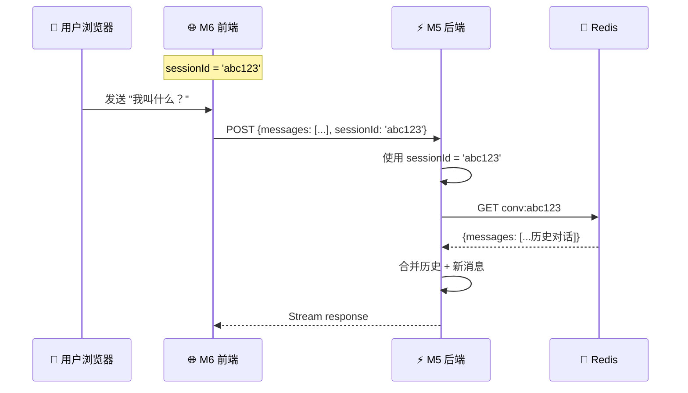

<!--
- [INPUT]: 依赖对 M6 会话持久化机制和 sessionId 生命周期的深入理解
- [OUTPUT]: sessionId 从生成到使用的完整技术详解
- [POS]: M6 会话管理的核心机制说明
- [PROTOCOL]: 变更时更新此头部，然后检查 CLAUDE.md
-->

# sessionId 生命周期完全解析

> **生成时间**: 2026-01-23  
> **讨论主题**: sessionId 的生成机制、传递流程、存储策略  
> **关联 Issue**: [#1 M6 会话持久化与上下文管理](https://github.com/exposir/ai-evolution-kit/issues/1)  
> **GitHub Issue**: [#2 sessionId 生命周期完全解析](https://github.com/exposir/ai-evolution-kit/issues/2)

---

## 一、核心问题

**sessionId 是如何得来的？**

这是理解会话持久化机制的关键 —— sessionId 是连接前端、后端、Redis 的唯一标识符。

---

## 二、生成机制

### 代码实现

```typescript
// M5: chat.service.ts (L110)
const sessionId = dto.sessionId || randomUUID();
```

### 逻辑

```typescript
if (前端传来了 sessionId) {
  使用前端的 sessionId  // 恢复现有会话
} else {
  生成新的 UUID        // 创建新会话
}
```

### UUID 格式

```
示例: "550e8400-e29b-41d4-a716-446655440000"
标准: RFC 4122 UUID v4
长度: 36 字符 (含4个连字符)
唯一性: 2^122 种可能，碰撞概率极低
```

---

## 三、完整数据流

### 第一轮对话（创建会话）



### 第二轮对话（使用会话）



---

## 四、代码实现详解

### 1. 前端初始化

```typescript
// M6: src/app/page.tsx (L1009)
const [sessionId, setSessionId] = useState<string | null>(null);
```

**设计决策**:

- ✅ 初始值为 `null` —— 表示还没有会话
- ✅ 类型为 `string | null` —— 明确可为空
- ❌ 不持久化到 LocalStorage —— Demo 简化实现

### 2. 前端发送请求

```typescript
// M6: src/app/page.tsx (L1081-1088)
const res = await fetch("/api/chat/stream", {
  method: "POST",
  headers: { "Content-Type": "application/json" },
  body: JSON.stringify({
    sessionId, // ← 首次为 null，后续为 UUID
    messages: [{ role: "user", content }],
  }),
});
```

**关键点**:

- 首次请求: `sessionId: null`
- 后续请求: `sessionId: "550e8400-..."`

### 3. 后端生成或使用

```typescript
// M5: chat.service.ts (L110)
const sessionId = dto.sessionId || randomUUID();

// 立即返回给前端
yield { type: 'sessionId', data: sessionId };
```

**为什么先发送 sessionId？**

- 前端需要**立即**保存用于后续请求
- 不能等到 LLM 回复生成完才发送
- 保证前端可以在 streaming 过程中继续对话

### 4. 前端接收并保存

```typescript
// M6: src/app/page.tsx (L1111-1113)
const parsed = JSON.parse(data);
if (parsed.sessionId) {
  setSessionId(parsed.sessionId); // ← 保存到 React state
}
```

**SSE 数据格式**:

```
data: {"sessionId":"550e8400-e29b-41d4-a716-446655440000"}
data: {"content":"你"}
data: {"content":"好"}
data: {"content":"！"}
data: [DONE]
```

### 5. 后端使用 sessionId 查询历史

```typescript
// M5: chat.service.ts (L119-125)
const history = await this.memoryService.getConversation(sessionId);
const historyMessages =
  history?.messages.map((m) => ({
    role: m.role,
    content: m.content,
  })) || [];

// 合并历史 + 新消息
const allMessages = [...historyMessages, ...dto.messages];
```

---

## 五、存储位置对比

| 位置          | 存储形式    | 生命周期       | 用途              |
| ------------- | ----------- | -------------- | ----------------- |
| **前端 (M6)** | React state | 页面刷新即丢失 | 请求时携带        |
| **后端 (M5)** | 函数参数    | 请求执行期间   | 查询 Redis 的 key |
| **Redis**     | Key 前缀    | 24 小时 TTL    | 持久化存储        |

### Redis Key 结构

```
Key:   conv:550e8400-e29b-41d4-a716-446655440000
Value: {
  "sessionId": "550e8400-e29b-41d4-a716-446655440000",
  "messages": [
    {"role": "user", "content": "你好", "timestamp": 1737670000000},
    {"role": "assistant", "content": "你好！", "timestamp": 1737670002000}
  ],
  "createdAt": 1737670000000,
  "updatedAt": 1737670002000
}
TTL:   86400 秒 (24小时)
```

---

## 六、完整示例对话

### 第一轮：创建会话

```typescript
// ===== 前端状态 =====
sessionId: null

// ===== 前端发送 =====
POST /api/chat/stream
Body: {
  "sessionId": null,
  "messages": [{"role": "user", "content": "你好"}]
}

// ===== 后端生成 =====
sessionId = randomUUID()
// → "550e8400-e29b-41d4-a716-446655440000"

// ===== 后端返回 =====
SSE Event 1:
data: {"sessionId":"550e8400-e29b-41d4-a716-446655440000"}

SSE Event 2-N:
data: {"content":"你"}
data: {"content":"好"}
data: {"content":"！"}
data: [DONE]

// ===== 前端更新 =====
setSessionId("550e8400-e29b-41d4-a716-446655440000")

// ===== Redis 存储 =====
SET conv:550e8400-e29b-41d4-a716-446655440000
{
  "sessionId": "550e8400-...",
  "messages": [
    {"role": "user", "content": "你好"},
    {"role": "assistant", "content": "你好！"}
  ]
}
EXPIRE 86400
```

### 第二轮：使用会话

```typescript
// ===== 前端状态 =====
sessionId: "550e8400-e29b-41d4-a716-446655440000"

// ===== 前端发送 =====
POST /api/chat/stream
Body: {
  "sessionId": "550e8400-e29b-41d4-a716-446655440000",
  "messages": [{"role": "user", "content": "我叫什么？"}]
}

// ===== 后端使用 =====
sessionId = "550e8400-e29b-41d4-a716-446655440000"
// ← 直接使用，不再生成

// ===== 后端查询 Redis =====
GET conv:550e8400-e29b-41d4-a716-446655440000
→ 返回完整历史对话

// ===== 后端合并上下文 =====
allMessages = [
  {"role": "user", "content": "你好"},
  {"role": "assistant", "content": "你好！"},
  {"role": "user", "content": "我叫什么？"}  // ← 新消息
]

// ===== 发送给 LLM =====
LLM 看到完整上下文 → 生成答案
```

---

## 七、关键设计问题

### 1. 为什么不用 Cookie？

**当前实现**: React state（刷新即丢）

**Cookie 方案的问题**:

- ❌ 需要配置 CORS
- ❌ 增加每次请求的 header 大小
- ❌ sessionId 本身不敏感，不需要 Cookie 保护

**更好的方案**: LocalStorage

```typescript
// 优化建议
const [sessionId, setSessionId] = useState<string | null>(() => {
  return localStorage.getItem("sessionId");
});

useEffect(() => {
  if (sessionId) {
    localStorage.setItem("sessionId", sessionId);
  }
}, [sessionId]);
```

### 2. 为什么后端要先发送 sessionId？

```typescript
// L115-116
yield { type: 'sessionId', data: sessionId };
// 然后再查询历史和生成回复
```

**原因**:

- 前端需要**立即**知道 sessionId
- 如果等到 LLM 回复完才发送，前端无法在此期间发起新请求
- SSE streaming 的第一个 chunk 必须是 sessionId

### 3. sessionId 何时过期？

| 位置      | 过期策略                |
| --------- | ----------------------- |
| **前端**  | 页面刷新/关闭立即丢失   |
| **Redis** | 24 小时后自动删除 (TTL) |

**现实场景**:

```
用户在对话中间刷新页面:
  → 前端 sessionId 丢失
  → Redis 数据仍存在
  → 但前端无法恢复会话
  → 下次对话会创建新 sessionId
```

**生产环境优化**:

- 使用 LocalStorage 持久化 sessionId
- 或提供"恢复会话"功能，让用户选择历史 sessionId

---

## 八、与其他方案对比

### JWT Token 方案

```typescript
// 替代方案：使用 JWT
const token = jwt.sign(
  { sessionId, userId, exp: Date.now() + 86400000 },
  SECRET_KEY,
);

// 前端携带
headers: {
  Authorization: `Bearer ${token}`;
}
```

**对比**:
| 方案 | 优势 | 劣势 |
|------|------|------|
| **UUID (当前)** | 简单、无需加密、体积小 | 无法防伪造、无法携带元数据 |
| **JWT** | 可验证、可携带用户信息 | 体积大、需要密钥管理 |

**为什么 M6 用 UUID？**

- Demo 项目，无需认证
- sessionId 本身不敏感
- 简单够用

### Session Cookie 方案

```typescript
// 传统方案：服务端 Session
app.use(
  session({
    secret: "secret-key",
    resave: false,
    saveUninitialized: true,
  }),
);
```

**为什么不用？**

- M6 是前后端分离架构
- 需要 CORS 配置
- 增加服务端状态管理复杂度

---

## 九、核心要点总结

### sessionId 的本质

> **sessionId 是前后端约定的、用于标识唯一会话的 UUID 字符串**

### 生命周期

```
1. 后端生成 (randomUUID)
2. 通过 SSE 返回给前端
3. 前端保存到 React state
4. 后续请求携带此 ID
5. 后端用此 ID 查询 Redis
6. Redis 24小时后自动过期
```

### 关键设计

- ✅ **后端生成** —— 保证唯一性
- ✅ **前端保存** —— 减少状态管理
- ✅ **立即返回** —— 支持连续对话
- ✅ **Redis TTL** —— 自动垃圾回收

### 一句话

> **sessionId 由后端用 `randomUUID()` 生成，通过 SSE 流的第一个 chunk 返回给前端，前端保存在 React state 中，后续请求带上此 ID，后端用它从 Redis 查询历史。**

---

## 相关资源

- [M6 会话持久化详解](https://github.com/exposir/ai-evolution-kit/issues/1)
- [ChatService 实现](https://github.com/exposir/ai-evolution-kit/blob/main/packages/05-server-core/src/chat/chat.service.ts#L107-L120)
- [前端 sessionId 管理](https://github.com/exposir/ai-evolution-kit/blob/main/packages/06-fullstack-demo/src/app/page.tsx#L1009)
- [MemoryService](https://github.com/exposir/ai-evolution-kit/blob/main/packages/05-server-core/src/memory/memory.service.ts)
