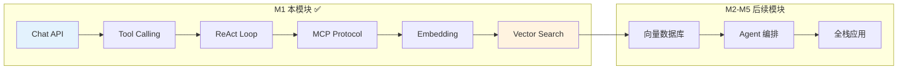
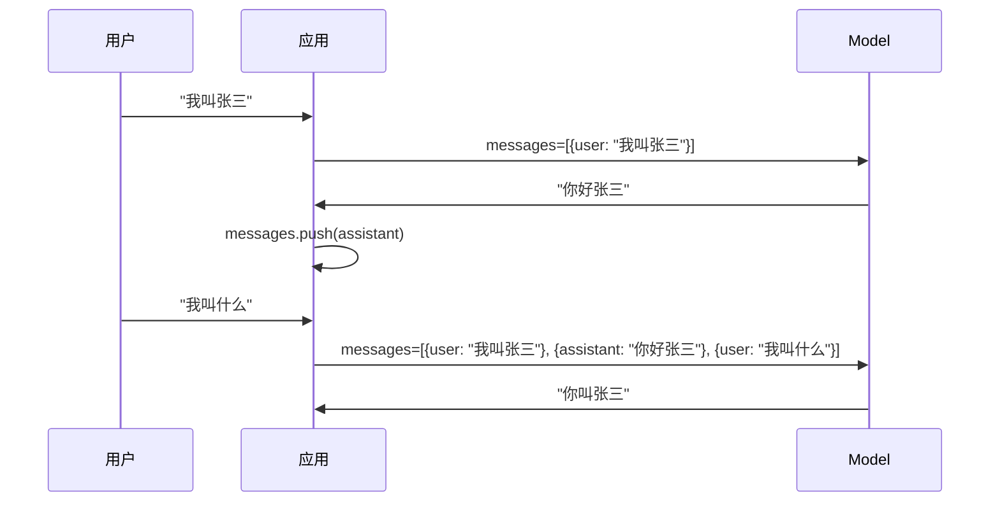
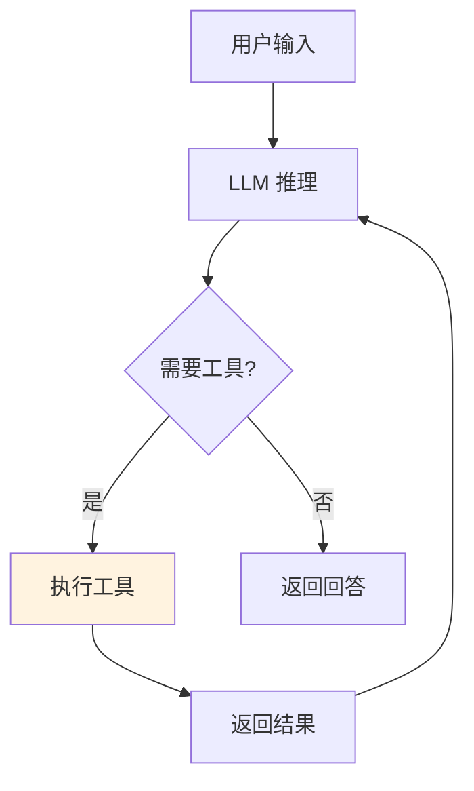
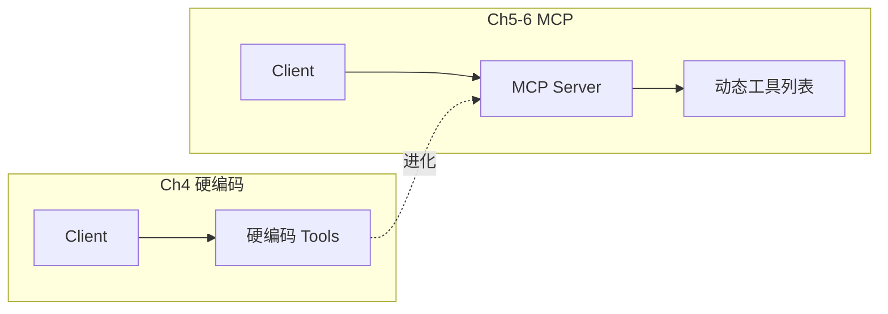
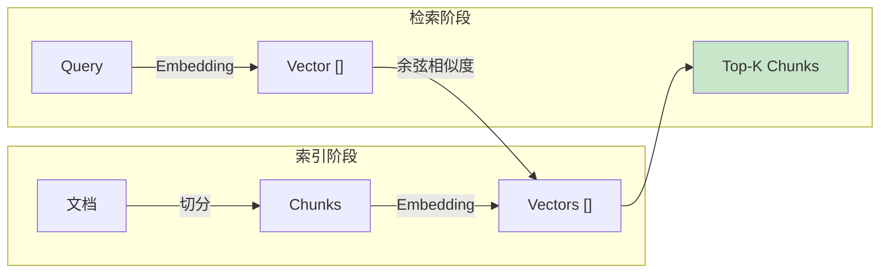

<!--
- [INPUT]: 依赖 Node.js 环境与 AI SDK 基础
- [OUTPUT]: 本文档提供 Milestone 1 的学习指南与实验说明
- [POS]: 01-runtime-lab 的 模块文档
- [PROTOCOL]: 变更时更新此头部，然后检查 CLAUDE.md
-->

# 01-runtime-lab

> **Milestone 1: The Runtime — AI 的手与眼**

从裸金属 Chat 到 RAG 检索的 8 章渐进式教程，让 AI 从"只会说话"进化到"能做事 + 能记住"。

## 在 AI Agent 全景中的定位



| 能力     | 比喻    | 章节  |
| -------- | ------- | ----- |
| 🗣️ Chat  | AI 的嘴 | Ch1   |
| 🔧 Tools | AI 的手 | Ch2-6 |
| 👁️ RAG   | AI 的眼 | Ch7-8 |

## 快速开始

```bash
cd packages/01-runtime-lab
pnpm install

# 配置 .env (见下方)
pnpm ch1   # 基础 Chat
pnpm ch3   # ReAct 循环
pnpm ch8   # 向量搜索
```

### 环境变量

```bash
OPENAI_API_KEY=sk-xxx
OPENAI_BASE_URL=https://api.example.com/v1
CHAT_MODEL=your-model-name
EMBEDDING_MODEL=your-embedding-model
```

## 章节导航

### Ch1: 裸金属对话 — 上下文记忆

理解 Chat Completion API 的本质：**无状态 + 手工管理历史**。



### Ch2-3: Tool Calling + ReAct — 让 AI 动手

从"Zod Schema 定义工具"到"while 循环执行工具调用"。



**核心闭环**：用户 → LLM → Tool → LLM → 用户

### Ch4-6: MCP Protocol — 工具标准化

从硬编码工具到 **声明-发现-调用** 解耦。



### Ch7-8: Embedding + RAG — 让 AI 看资料

从文本到向量，从向量到语义检索。



## 文件结构

```
src/
├── 01-chat.ts        # Chat API + 上下文
├── 01-chat-stream.ts # 流式输出
├── 02-tools.ts       # Zod → JSON Schema
├── 03-loop.ts        # ReAct while 循环
├── 04-system.ts      # 文件系统工具
├── 05-mcp-server.ts  # MCP Server 声明
├── 06-mcp-client.ts  # MCP Client 发现
├── 07-embedding.ts   # 文本向量化
├── 08-search.ts      # 余弦相似度检索
```

## 验收清单

| 章节 | 验收标准        | 验证方式                  |
| ---- | --------------- | ------------------------- |
| Ch1  | AI 记住上轮对话 | 说名字 → 问"我叫什么"     |
| Ch3  | 工具调用闭环    | 算 123+456 → 返回 579     |
| Ch6  | MCP 动态发现    | 问天气 → 调用 Server 工具 |
| Ch8  | RAG 检索回答    | 问项目名 → 基于知识库回答 |

## 学完之后

你已掌握：

- **Chat API**：无状态本质 + 手工历史管理
- **Tool Calling**：Zod Schema + function 定义
- **ReAct Agent**：while 循环的决策-执行闭环
- **MCP 协议**：工具声明与调用的解耦设计
- **RAG 基础**：Embedding + 余弦相似度检索

**当前进度**：AI 已有"手"(Tools) 和"眼"(RAG)，但检索结果是内存版，不持久。

➡️ 下一步：[02-data-forge](../02-data-forge) — 向量数据库持久化
