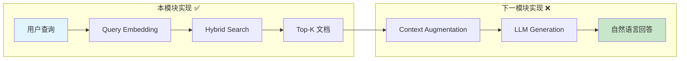
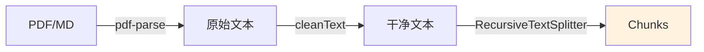
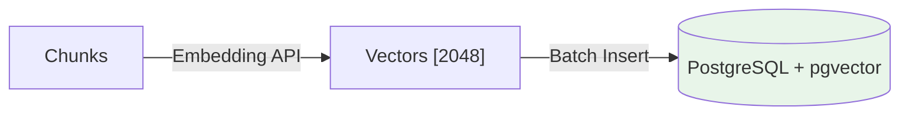
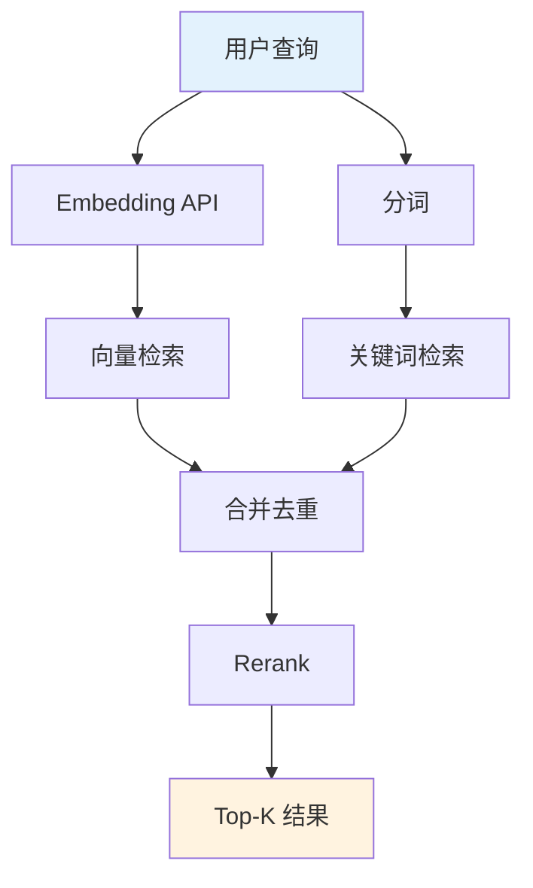
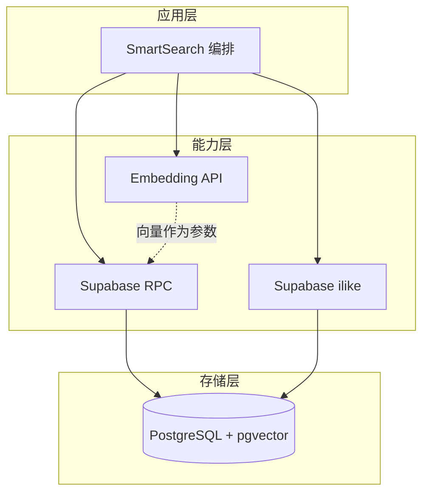

<!--
- [INPUT]: 依赖 基础数据处理与 RAG 知识
- [OUTPUT]: 本文档提供 Milestone 2 的数据管道构建指南
- [POS]: 02-data-forge 的 模块文档
- [PROTOCOL]: 变更时更新此头部，然后检查 CLAUDE.md
-->

# 02-data-forge

> **Milestone 2: Data Foundation — 记忆宫殿**

为 AI 构建**长期记忆层**的 3 章生产级教程。从文档清洗到向量检索，实现 RAG 系统的 Retrieval 核心。

## 在 RAG 全景中的定位



| 步骤 | 名称                | 状态 | 实现位置         |
| ---- | ------------------- | :--: | ---------------- |
| R    | Retrieval (检索)    |  ✅  | `Ch9-11`         |
| A    | Augmentation (增强) |  ❌  | `03-agent-brain` |
| G    | Generation (生成)   |  ❌  | `03-agent-brain` |

## 快速开始

```bash
cd packages/02-data-forge
pnpm install

# 配置 .env (见下方环境变量)
pnpm ch9   # 文档清洗
pnpm ch10  # 向量入库
pnpm ch11  # 混合检索
```

### 环境变量

```bash
# Embedding API
OPENAI_API_KEY=sk-xxx
OPENAI_BASE_URL=https://api.example.com/v1
EMBEDDING_MODEL=your-embedding-model

# Supabase (Ch10-11)
SUPABASE_URL=https://xxx.supabase.co
SUPABASE_SERVICE_KEY=eyJxxx
```

## 章节导航

### Ch9: 文档清洗 — Extract → Clean → Split

将脏数据转化为干净的文本块，为向量化做准备。



**核心能力**：

- 多格式支持 (PDF/Markdown/TXT)
- 不可见字符清理、空白归一化
- 递归切分策略：优先段落 → 句子 → 字符

### Ch10: 向量数据库 — Supabase + pgvector

将 Chunks 转为向量并持久化存储。



**核心能力**：

- 批量向量化 (Rate Limit 控制)
- Supabase RPC 函数封装
- 余弦相似度检索

### Ch11: 混合检索 — Vector + Keyword + Rerank

向量语义搜索 + 关键词精确匹配的混合策略。



**核心能力**：

- 语义理解 (向量) + 精确匹配 (ilike)
- 向量优先、关键词兜底策略
- 简易 Rerank (生产环境建议用专业模型)

## 技术架构



## Supabase 配置

在 SQL Editor 执行：

```sql
-- 启用 pgvector
CREATE EXTENSION IF NOT EXISTS vector;

-- 文档表
CREATE TABLE documents (
  id BIGSERIAL PRIMARY KEY,
  content TEXT NOT NULL,
  metadata JSONB DEFAULT '{}',
  embedding VECTOR(2048),
  created_at TIMESTAMPTZ DEFAULT NOW()
);

-- 检索函数
CREATE OR REPLACE FUNCTION match_documents (
  query_embedding VECTOR(2048),
  match_threshold FLOAT DEFAULT 0.7,
  match_count INT DEFAULT 5
) RETURNS TABLE (
  id BIGINT, content TEXT, metadata JSONB, similarity FLOAT
) LANGUAGE plpgsql AS $$
BEGIN
  RETURN QUERY
  SELECT d.id, d.content, d.metadata,
         1 - (d.embedding <=> query_embedding) AS similarity
  FROM documents d
  WHERE 1 - (d.embedding <=> query_embedding) > match_threshold
  ORDER BY similarity DESC
  LIMIT match_count;
END;
$$;
```

> **⚠️ 注意**：向量维度需根据使用的 Embedding 模型调整。pgvector 索引限制 2000 维，超过需无索引运行。

## 文件结构

```
src/
├── 09-doc-cleaner.ts   # ETL 管道：Extract → Clean → Split
├── 10-vector-db.ts     # 向量持久化：Supabase + pgvector
├── 11-smart-search.ts  # 混合检索：Vector + Keyword + Rerank
sample.md               # 测试用示例文档
```

## 验收清单

| 章节 | 验收标准                 | 验证方式                      |
| ---- | ------------------------ | ----------------------------- |
| Ch9  | PDF 正确提取并切分       | `pnpm ch9` → 检查 chunks 数量 |
| Ch10 | 向量成功入库             | Supabase → documents 表有数据 |
| Ch11 | 混合检索返回语义相关结果 | 搜索关键词 → 返回相关内容     |

### Supabase 依赖检查

- [ ] 项目已创建
- [ ] `vector` 扩展已启用
- [ ] `match_documents` 函数已创建
- [ ] `.env` 配置正确

## 学完之后

你已掌握：

- **ETL 管道**：文档预处理的标准流程
- **向量存储**：pgvector 的存取操作
- **混合检索**：向量 + 关键词的互补策略
- **Rate Limit**：批量 API 调用的节流控制

**当前进度**：RAG 的 **R (Retrieval)** 已完成，**AG (Augmented Generation)** 在下一模块实现。

➡️ 下一步：[03-agent-brain](../03-agent-brain) — LangGraph 状态机编排 + LLM 生成
