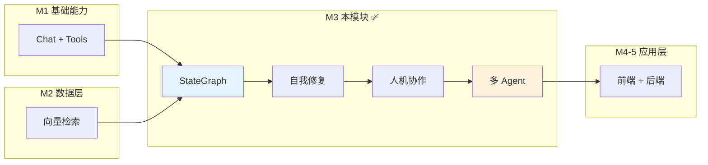
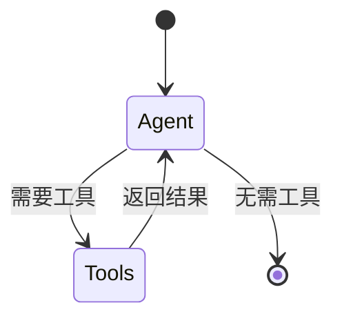
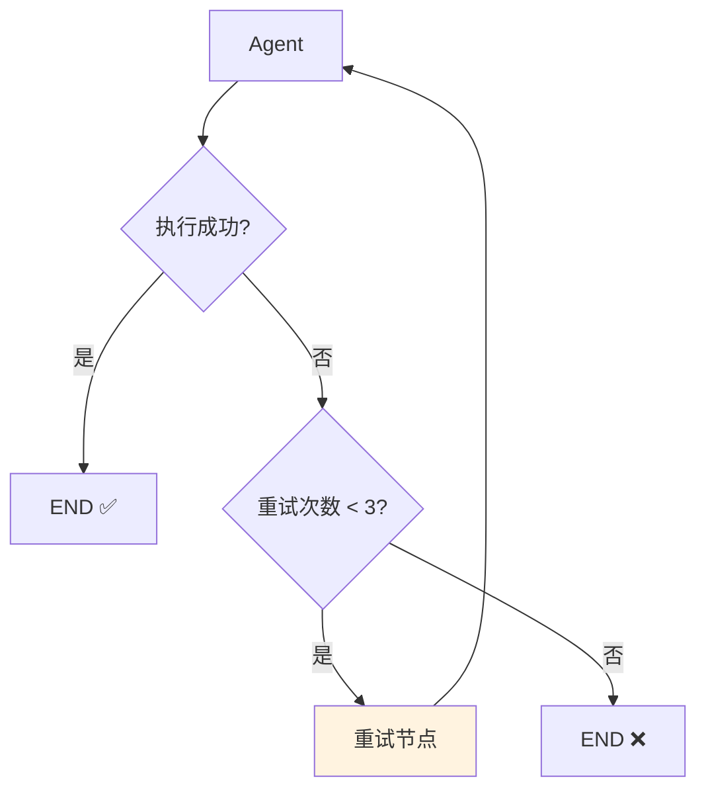
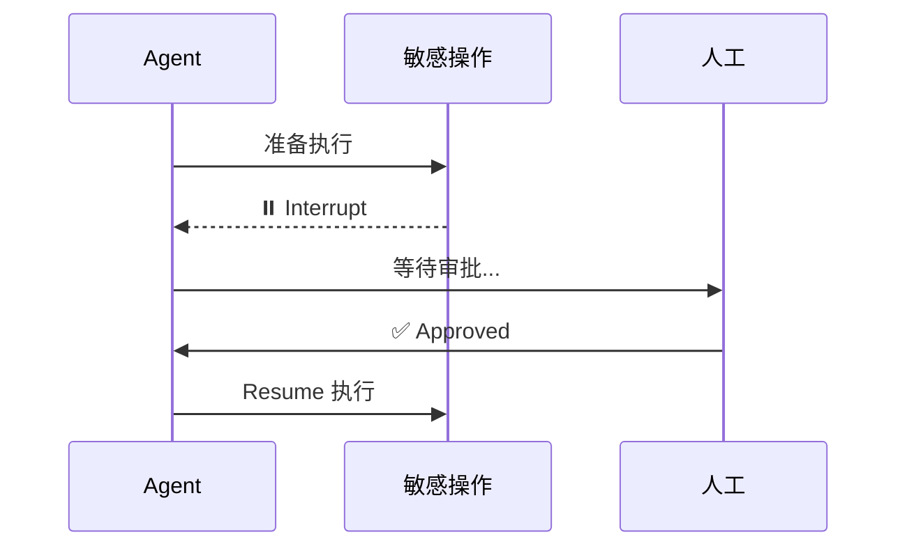
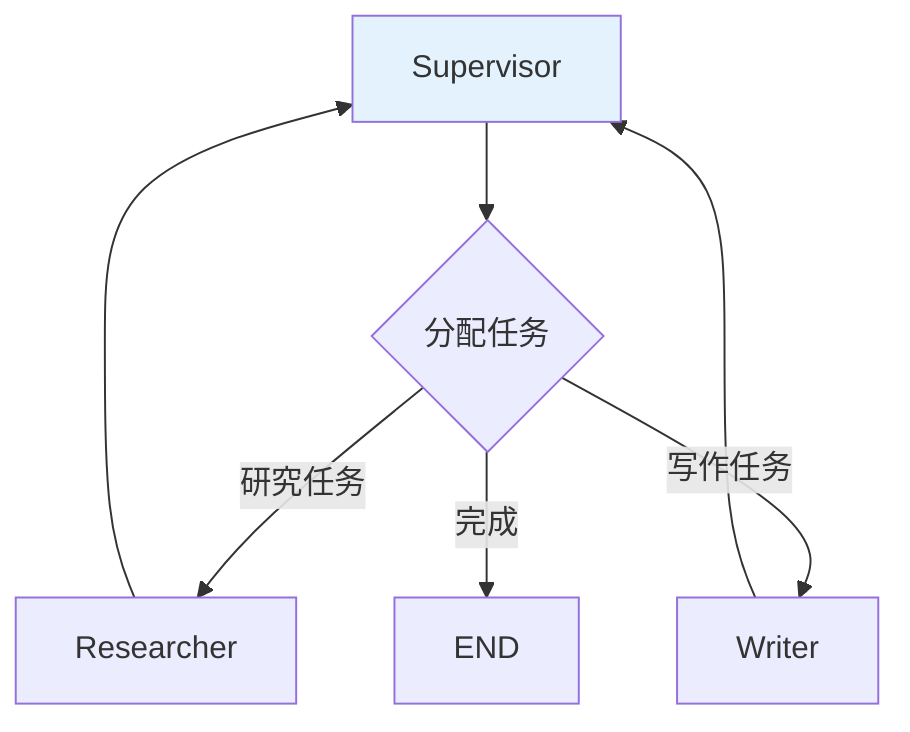

<!--
- [INPUT]: 依赖 LangGraph 与 Agent 编排理论
- [OUTPUT]: 本文档提供 Milestone 3 的 Agent 构建指南
- [POS]: 03-agent-brain 的 模块文档
- [PROTOCOL]: 变更时更新此头部，然后检查 CLAUDE.md
-->

# 03-agent-brain

> **Milestone 3: Agent Orchestration — 逻辑大脑**

用 LangGraph 构建状态机驱动的复杂 Agent，从手工 while 循环进化到声明式图结构。

## 在 AI Agent 全景中的定位



| 演进     | M1 (while 循环) | M3 (StateGraph)      |
| -------- | --------------- | -------------------- |
| 流程控制 | if/else         | 声明式图             |
| 状态管理 | 手工 messages[] | Annotation + Reducer |
| 错误处理 | 无              | Conditional Edge     |
| 人工介入 | 无              | Interrupt/Resume     |
| 多 Agent | 无              | Supervisor 模式      |

## 快速开始

```bash
cd packages/03-agent-brain
pnpm install

pnpm ch12  # StateGraph 基础
pnpm ch13  # 自我修复回路
pnpm ch14  # 人机协作 (交互式)
pnpm ch15  # 多 Agent 团队
```

### 环境变量

```bash
OPENAI_API_KEY=sk-xxx
OPENAI_BASE_URL=https://open.bigmodel.cn/api/paas/v4
CHAT_MODEL=glm-4-airx
```

## 章节导航

### Ch12: StateGraph 入门 — Node/Edge/State

理解 LangGraph 的核心三要素。



### Ch13: 自我修复 — 错误重试机制

实现"检测错误 → 自动重试 → 次数限制"的闭环。



### Ch14: 人机协作 — Interrupt/Resume

敏感操作前暂停，等待人工审批后继续。



### Ch15: Supervisor 模式 — 多 Agent 协作

一个"主管"分发任务给多个"专家"。



## LangGraph 核心概念

| 概念             | 说明         | 类比           |
| ---------------- | ------------ | -------------- |
| StateGraph       | 状态图容器   | XState Machine |
| Node             | 状态处理函数 | Redux Reducer  |
| Edge             | 节点连接     | 状态转移       |
| Conditional Edge | 条件路由     | Switch/Case    |
| Annotation       | 状态定义     | Redux State    |
| Checkpointer     | 状态持久化   | 游戏存档       |
| Interrupt        | 执行中断     | 断点调试       |

## 文件结构

```
src/
├── 12-state-graph.ts     # StateGraph 入门
├── 13-self-correction.ts # 错误重试机制
├── 14-human-loop.ts      # 人工介入
├── 15-team-work.ts       # Supervisor 多 Agent
```

## 验收清单

| 章节 | 验收标准       | 验证方式            |
| ---- | -------------- | ------------------- |
| Ch12 | 图正确执行节点 | 观察日志节点顺序    |
| Ch13 | 报错后自动重试 | 触发错误 → 重试日志 |
| Ch14 | 敏感操作前暂停 | 打印等待 → 输入 yes |
| Ch15 | 任务正确分发   | 观察 R→W 流转       |

## 学完之后

你已掌握：

- **StateGraph**：声明式 Agent 编排
- **Conditional Edge**：动态路由决策
- **Checkpointer**：状态持久化与恢复
- **Interrupt/Resume**：人机协作机制
- **Supervisor**：多 Agent 组织模式

**当前进度**：Agent 大脑已成型，但缺少用户界面和生产级后端。

➡️ 下一步：[04-next-client](../04-next-client) — 流式 UI 交互
