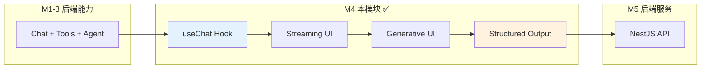
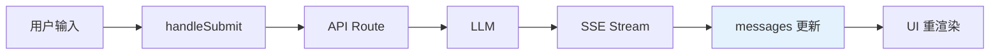
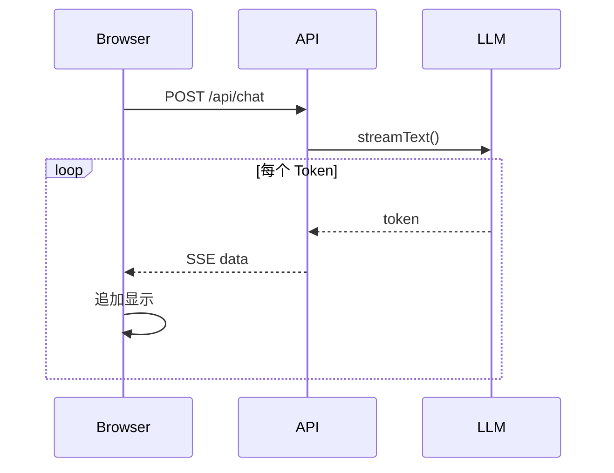
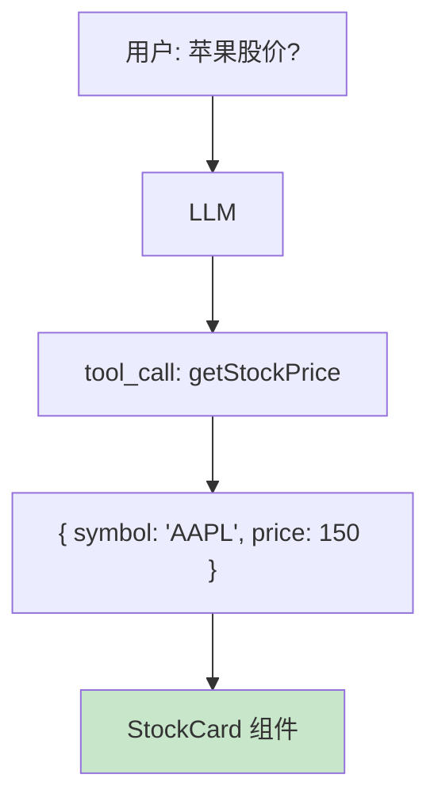
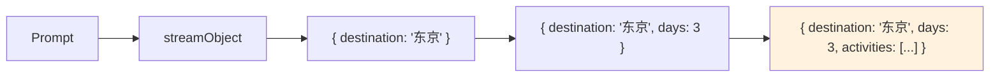
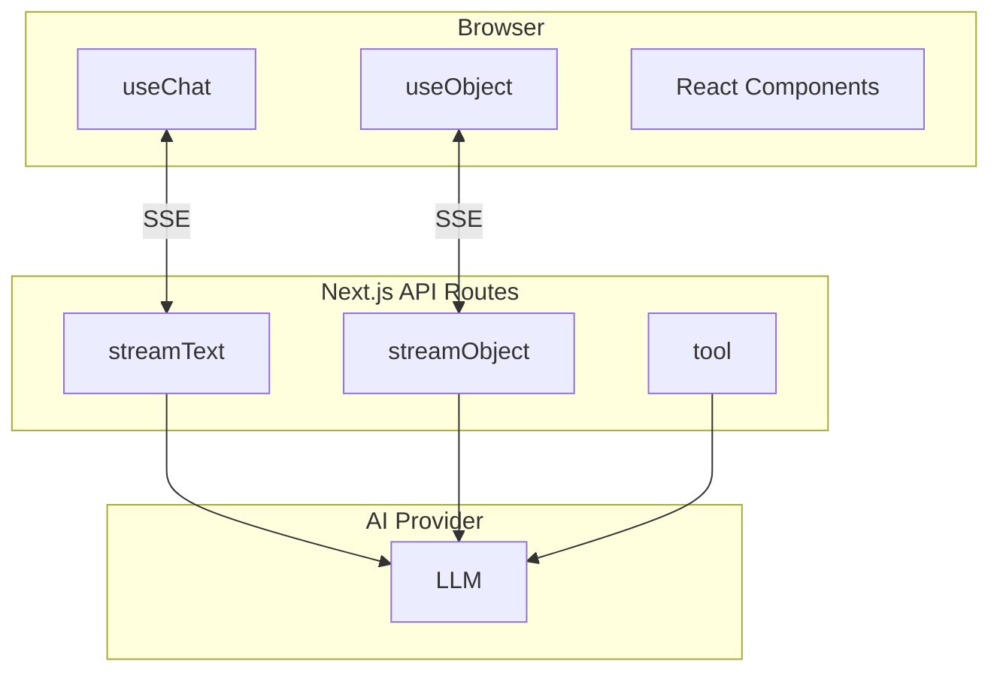

<!--
- [INPUT]: 依赖 Next.js 与 Vercel AI SDK 前端集成
- [OUTPUT]: 本文档提供 Milestone 4 的全栈应用前端指南
- [POS]: 04-next-client 的 模块文档
- [PROTOCOL]: 变更时更新此头部，然后检查 CLAUDE.md
-->

# 04-next-client

> **Milestone 4: AI UX Engineering — 交互界面**

用 Vercel AI SDK 构建丝滑的 AI 交互体验，让 AI 输出 UI，实现流式交互。

## 在 AI Agent 全景中的定位



| 能力          | 说明          | 类比         |
| ------------- | ------------- | ------------ |
| 🎯 useChat    | 状态管理      | Redux for AI |
| ⚡ Streaming  | 打字机效果    | ChatGPT 体验 |
| 🎨 GenUI      | AI 出组件     | v0.dev 原理  |
| 📊 Structured | JSON 实时填充 | 表单自动生成 |

## 快速开始

```bash
cd packages/04-next-client
pnpm install
pnpm dev    # http://localhost:3000
```

### 访问章节

| 章节 | URL   | 功能                 |
| ---- | ----- | -------------------- |
| Ch16 | /ch16 | useChat 基础对话     |
| Ch17 | /ch17 | 流式打字机效果       |
| Ch18 | /ch18 | 生成式 UI (工具调用) |
| Ch19 | /ch19 | 结构化数据输出       |

### 环境变量

```bash
OPENAI_API_KEY=sk-xxx
OPENAI_BASE_URL=https://api.example.com/v1
CHAT_MODEL=your-model-name
```

## 章节导航

### Ch16: useChat Hook — 状态管理

Vercel AI SDK 的核心：自动管理 messages、loading、error。



### Ch17: Streaming UI — Token 级流式

逐 Token 输出，ChatGPT 同款打字机效果。



### Ch18: Generative UI — AI 出组件

**v0.dev 的核心原理**：AI 通过 tool() 返回结构化数据，前端渲染对应组件。



### Ch19: Structured Output — 实时 JSON 填充

`useObject` + `streamObject`：边生成边填充结构化数据。



## 技术架构



## 文件结构

```
src/app/
├── layout.tsx          # 全局布局
├── page.tsx            # 首页导航
├── ch16/page.tsx       # useChat
├── ch17/page.tsx       # Streaming
├── ch18/page.tsx       # GenUI
├── ch19/page.tsx       # Structured
└── api/
    ├── chat/route.ts       # 基础聊天
    ├── gen-ui/route.ts     # 工具调用
    └── structured/route.ts # 结构化输出
```

## 验收清单

| 章节 | 验收标准        | 验证方式           |
| ---- | --------------- | ------------------ |
| Ch16 | 消息自动追加    | 发送 → 列表更新    |
| Ch17 | 逐字显示        | 观察打字机效果     |
| Ch18 | 渲染 React 组件 | 问股价 → StockCard |
| Ch19 | JSON 实时填充   | 观察数据逐步出现   |

## 学完之后

你已掌握：

- **useChat**：AI 对话状态管理
- **streamText**：SSE 流式传输
- **tool()**：AI 调用 React 组件
- **useObject**：结构化数据实时填充

**当前进度**：前端体验已完成，但缺少生产级后端（限流、认证、缓存）。

➡️ 下一步：[05-server-core](../05-server-core) — NestJS 后端堡垒
