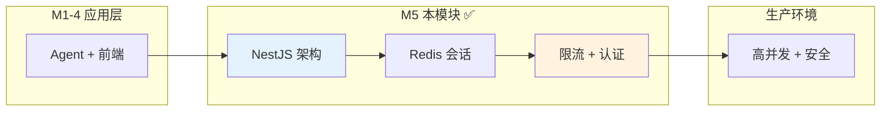
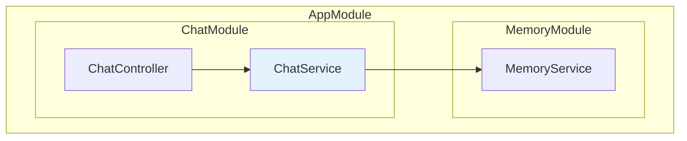
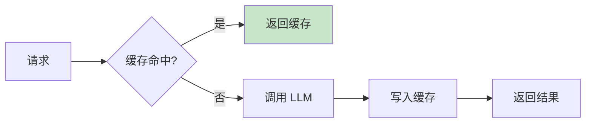
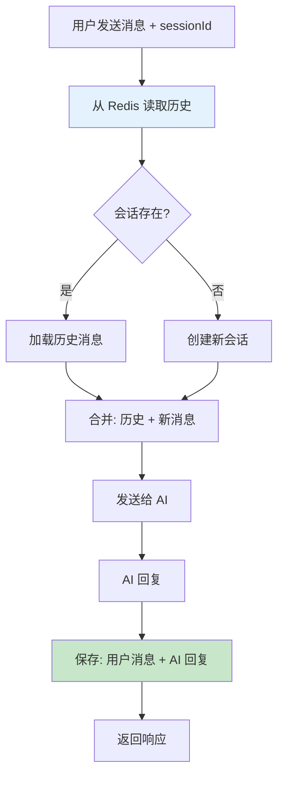
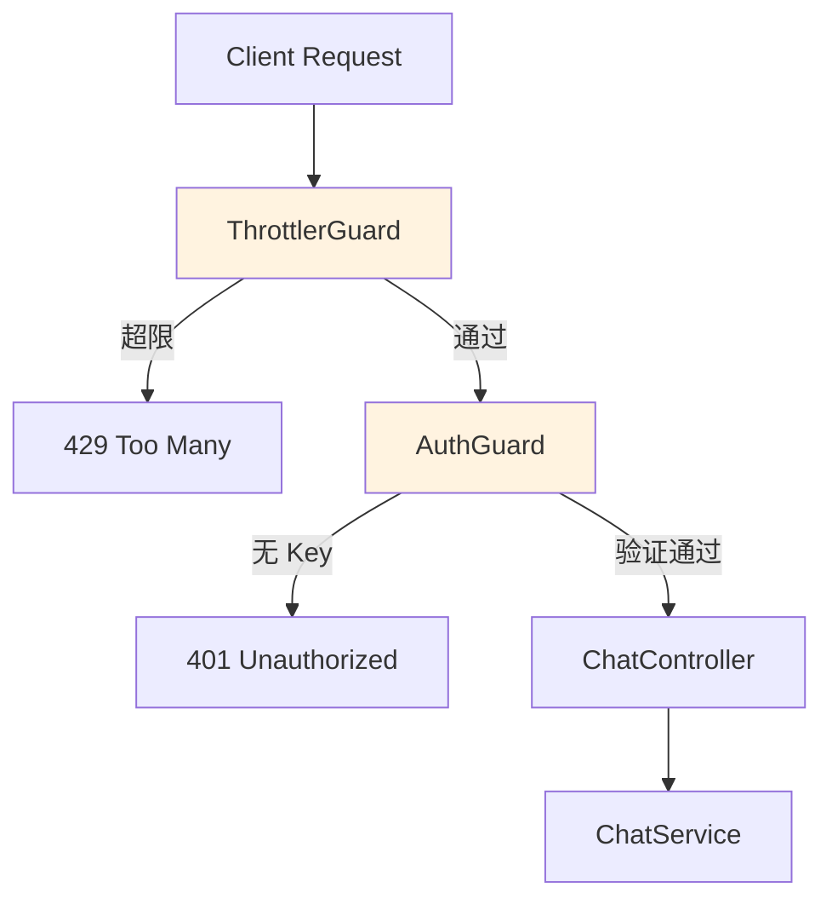
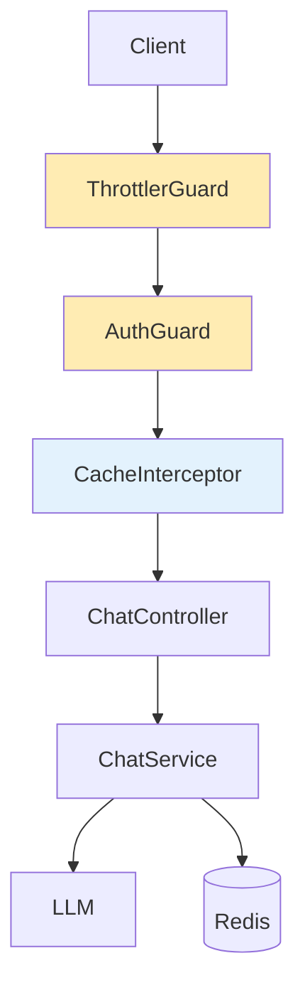
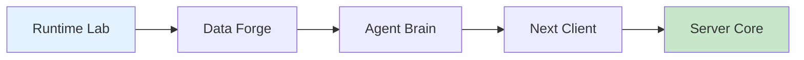

<!--
- [INPUT]: 依赖 NestJS 与后端架构设计
- [OUTPUT]: 本文档提供 Milestone 5 的生产级后端开发指南
- [POS]: 05-server-core 的模块文档
- [PROTOCOL]: 变更时更新此头部，然后检查 CLAUDE.md
-->

# 05-server-core

> **Milestone 5: Server Core — NestJS 后端堡垒**

解决并发、安全、成本问题，构建生产级 AI 后端服务。

## 在 AI Agent 全景中的定位



| 问题    | 解决方案     | 章节 |
| ------- | ------------ | ---- |
| 🔒 安全 | API Key 认证 | Ch22 |
| ⚡ 并发 | 请求限流     | Ch22 |
| 💾 成本 | Redis 缓存   | Ch21 |
| 📦 架构 | 模块化 DI    | Ch20 |

## 快速开始

```bash
cd packages/05-server-core
pnpm install
pnpm dev    # http://localhost:3001
```

### 环境变量

```bash
# AI (必需)
OPENAI_API_KEY=sk-xxx
OPENAI_BASE_URL=https://api.example.com/v1
CHAT_MODEL=your-model-name

# Redis (可选，用于会话持久化)
REDIS_URL=redis://localhost:6379

# 认证 (可选)
API_KEY=your-secret-api-key
```

## API 端点

| Method | Path         | 说明                       | 会话持久化 | 认证 |
| ------ | ------------ | -------------------------- | :--------: | :--: |
| POST   | /chat        | 同步对话，一次性返回完整响应 |     ✅     |  ✅  |
| POST   | /chat/stream | 流式对话，SSE 逐 token 返回  |     ✅     |  ✅  |
| GET    | /health      | 健康检查，返回服务状态       |     ❌     |  ❌  |

**会话持久化说明**:
- 两种端点都支持通过 `sessionId` 实现多轮对话
- 历史消息自动从 Redis 加载并合并到请求中
- 对话完成后自动保存到 Redis（TTL 24 小时）

### 请求示例

```bash
# 同步对话 (带会话持久化)
curl -X POST http://localhost:3001/chat \
  -H "X-API-Key: your-secret-api-key" \
  -H "Content-Type: application/json" \
  -d '{
    "sessionId": "my-session-123",
    "messages": [{"role":"user","content":"我叫小明"}]
  }'

# 流式对话 (带会话持久化)
curl -N -X POST http://localhost:3001/chat/stream \
  -H "X-API-Key: your-secret-api-key" \
  -H "Content-Type: application/json" \
  -d '{
    "sessionId": "my-session-123",
    "messages": [{"role":"user","content":"我叫什么名字？"}]
  }'

# 输出格式 (SSE):
# data: {"sessionId":"my-session-123"}
# data: {"content":"你"}
# data: {"content":"叫"}
# data: {"content":"小明"}
# data:
## 章节导航

### Ch20: NestJS 架构 — Controller/Service/Module

模块化 + 依赖注入，告别 Express 手工装配。



**核心概念**:
- **Controller**: HTTP 请求入口，负责路由和参数校验
- **Service**: 业务逻辑层，可被多个 Controller 复用
- **Module**: 功能模块封装，通过 DI 解耦依赖关系

### Ch21: Redis Memory — 会话持久化 + 缓存

解决"重启丢失"和"重复调用"问题。



#### 持久对话原理

**存储格式**

每个会话在 Redis 中存储为一个 Key-Value 对：

```typescript
// Redis Key
"conv:{sessionId}"

// Redis Value (JSON)
{
  sessionId: "uuid-xxx",
  messages: [
    { role: "user", content: "我叫小明", timestamp: 1234567890 },
    { role: "assistant", content: "你好，小明！", timestamp: 1234567891 }
  ],
  metadata: {},
  createdAt: 1234567890,
  updatedAt: 1234567891
}
```

**工作流程**



**关键实现** (`memory.service.ts`)

```typescript
// 1. 读取会话历史
async getConversation(sessionId: string): Promise<ConversationState | null> {
  const key = 'conv:' + sessionId;
  const data = await this.redis.get(key);
  return data ? JSON.parse(data) : null;
}

// 2. 追加新消息
async appendMessage(sessionId: string, message: Message) {
  let state = await this.getConversation(sessionId);

  if (!state) {
    state = {
      sessionId,
      messages: [],
      metadata: {},
      createdAt: Date.now(),
      updatedAt: Date.now(),
    };
  }

  state.messages.push({ ...message, timestamp: Date.now() });
  await this.saveConversation(state);
}

// 3. 保存会话（带 TTL）
async saveConversation(state: ConversationState): Promise<void> {
  const key = 'conv:' + state.sessionId;
  await this.redis.setex(
    key,
    this.TTL.CONVERSATION,  // 86400 秒 = 24 小时
    JSON.stringify(state)
  );
}
```

**流式对话的会话持久化** (`chat.service.ts`)

```typescript
async *streamChat(dto: ChatRequestDto) {
  const sessionId = dto.sessionId || randomUUID();
  
  // 1. 先发送 sessionId 给前端
  yield { type: 'sessionId', data: sessionId };
  
  // 2. 加载历史消息
  const history = await this.memoryService.getConversation(sessionId);
  const allMessages = [...(history?.messages || []), ...dto.messages];
  
  // 3. 流式生成回复
  const result = streamText({ model: this.openai(model), messages: allMessages });
  let fullContent = '';
  for await (const chunk of result.textStream) {
    fullContent += chunk;
    yield { type: 'content', data: chunk };
  }
  
  // 4. 保存对话到 Redis
  for (const msg of dto.messages) {
    await this.memoryService.appendMessage(sessionId, msg);
  }
  await this.memoryService.appendMessage(sessionId, {
    role: 'assistant',
    content: fullContent,
  });
}
```

**TTL（过期时间）配置**

在 `memory.service.ts` 中定义：

```typescript
private readonly TTL = {
  CONVERSATION: 60 * 60 * 24,  // 24 小时（86400 秒）
  CACHE: 60 * 5,               // 5 分钟（300 秒）
};
```

使用 Redis `SETEX` 命令写入时自动设置过期时间：
- 每次 `appendMessage` 都会刷新 TTL
- 24 小时后 Redis 自动删除，节省存储空间
- 修改 `TTL.CONVERSATION` 值即可调整过期时间

**优缺点分析**

| 优点 | 缺点 |
|------|------|
| ✅ 简单直观，sessionId 即会话隔离 | ❌ 长对话会占用较多内存 |
| ✅ 支持多轮上下文对话 | ❌ 历史过长可能超 token 限制 |
| ✅ 自动过期（24h TTL） | ❌ 未做滑动窗口优化 |
| ✅ 重启不丢失历史 | ❌ 每次加载全部历史消息 |
| ✅ 同步/流式端点都支持 | ❌ 需要 Redis 外部依赖 |

**改进方向**

1. **限制历史长度**：只保留最近 N 条消息
2. **Token 计数**：超限自动截断早期对话
3. **冷热分离**：近期消息存 Redis，历史归档到 DB
4. **滑动窗口**：动态调整上下文长度

### Ch22: Guardrails — 限流 + 认证

保护 API 免受滥用，控制访问权限。



**限流配置**：

- 1 秒 10 次
- 10 秒 100 次
- 60 秒 1000 次

## 请求处理链路



## 文件结构

```
src/
├── main.ts              # 入口
├── app.module.ts        # 根模块
├── chat/                # Ch20
│   ├── chat.controller.ts
│   ├── chat.service.ts
│   └── dto/chat.dto.ts
├── memory/              # Ch21
│   └── memory.service.ts
├── common/              # Ch22
│   ├── guards/auth.guard.ts
│   └── interceptors/cache.interceptor.ts
└── config/
    └── env.validation.ts
```

## 验收清单

| 章节 | 验收标准 | 验证方式 |
| ---- | -------- | -------- |
| Ch20 | 接口正常响应 | curl /chat |
| Ch21 | 会话持久化（同步+流式） | 多轮对话测试 |
| Ch21 | 重启后历史存在 | 重启服务后继续对话 |
| Ch22 | 限流生效 | 超限返回 429 |

### 会话持久化测试

```bash
# 1. 第一轮对话（创建会话）
curl -X POST http://localhost:3001/chat/stream \
  -H "Content-Type: application/json" \
  -d '{"messages":[{"role":"user","content":"我叫小明"}]}'

# 输出会包含 sessionId:
# data: {"sessionId":"abc-123-xyz"}
# data: {"content":"你好，小明！"}

# 2. 第二轮对话（使用相同 sessionId）
curl -X POST http://localhost:3001/chat/stream \
  -H "Content-Type: application/json" \
  -d '{
    "sessionId":"abc-123-xyz",
    "messages":[{"role":"user","content":"我叫什么名字？"}]
  }'

# 输出会显示 AI 记住了你的名字:
# data: {"content":"你叫小明"}
```

### 限流测试

```bash
for i in {1..15}; do
  curl -X POST http://localhost:3001/chat \
    -H "Content-Type: application/json" \
    -d '{"messages":[{"role":"user","content":"hi"}]}'
done
# 第 11 条应返回 429
```

## 学完之后

你已掌握：

- **NestJS 模块化**：Controller/Service/Module/DI
- **Guard 机制**：请求拦截与权限验证
- **Interceptor**：请求/响应处理管道
- **Redis 集成**：会话持久化 + 响应缓存
- **SSE 流式**：Server-Sent Events 实现

🎉 **恭喜完成全部 22 章节！**

你已经掌握了从基础 Chat 到生产级 AI 后端的完整技术栈：


