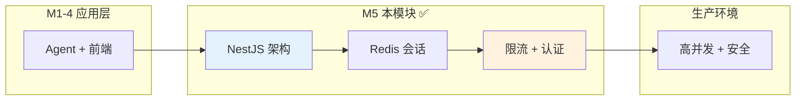
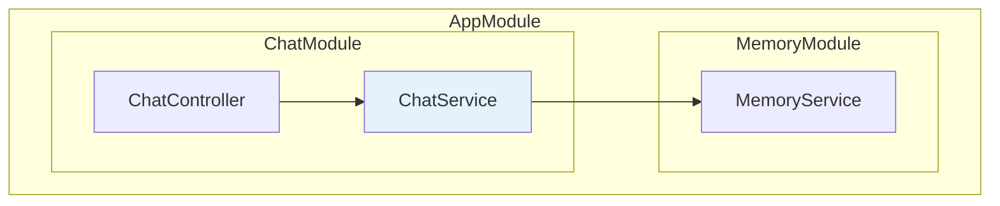
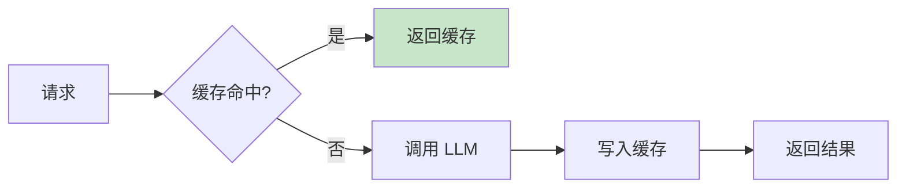
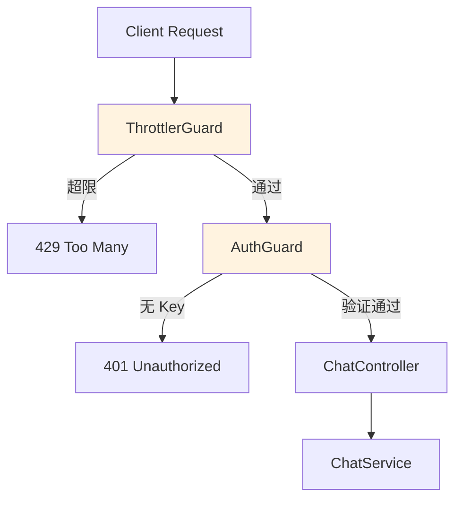
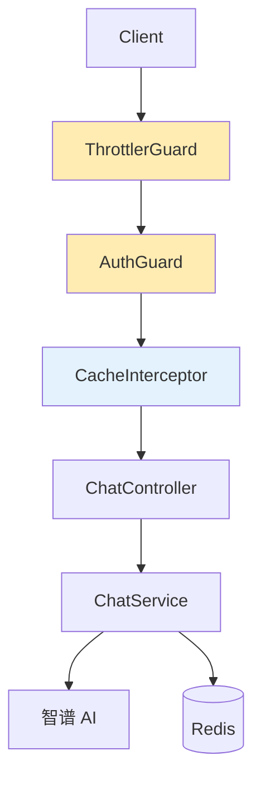
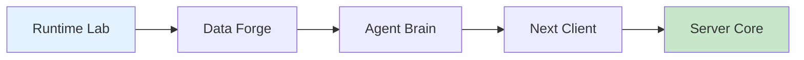

<!--
- [INPUT]: 依赖 NestJS 与后端架构设计
- [OUTPUT]: 本文档提供 Milestone 5 的生产级后端开发指南
- [POS]: 05-server-core 的 模块文档
- [PROTOCOL]: 变更时更新此头部，然后检查 CLAUDE.md
-->

# 05-server-core

> **Milestone 5: Server Core — NestJS 后端堡垒**

解决并发、安全、成本问题，构建生产级 AI 后端服务。

## 在 AI Agent 全景中的定位



| 问题    | 解决方案     | 章节 |
| ------- | ------------ | ---- |
| 🔒 安全 | API Key 认证 | Ch22 |
| ⚡ 并发 | 请求限流     | Ch22 |
| 💾 成本 | Redis 缓存   | Ch21 |
| 📦 架构 | 模块化 DI    | Ch20 |

## 快速开始

```bash
cd packages/05-server-core
pnpm install
pnpm dev    # http://localhost:3001
```

### 环境变量

```bash
# AI (必需)
OPENAI_API_KEY=sk-xxx
OPENAI_BASE_URL=https://open.bigmodel.cn/api/paas/v4
CHAT_MODEL=glm-4-airx

# Redis (可选)
REDIS_URL=redis://localhost:6379

# 认证 (可选)
API_KEY=your-secret-api-key
```

## API 端点

| Method | Path         | 说明     | 认证 |
| ------ | ------------ | -------- | :--: |
| POST   | /chat        | 同步对话 |  ✅  |
| POST   | /chat/stream | 流式对话 |  ✅  |
| GET    | /health      | 健康检查 |  ❌  |

### 请求示例

```bash
# 同步对话
curl -X POST http://localhost:3001/chat \
  -H "X-API-Key: your-secret-api-key" \
  -H "Content-Type: application/json" \
  -d '{"messages":[{"role":"user","content":"hello"}]}'

# 流式对话
curl -N -X POST http://localhost:3001/chat/stream \
  -H "X-API-Key: your-secret-api-key" \
  -H "Content-Type: application/json" \
  -d '{"messages":[{"role":"user","content":"count 1 to 5"}]}'
```

## 章节导航

### Ch20: NestJS 架构 — Controller/Service/Module

模块化 + 依赖注入，告别 Express 手工装配。



### Ch21: Redis Memory — 会话持久化 + 缓存

解决"重启丢失"和"重复调用"问题。



### Ch22: Guardrails — 限流 + 认证

保护 API 免受滥用，控制访问权限。



**限流配置**：

- 1 秒 10 次
- 10 秒 100 次
- 60 秒 1000 次

## 请求处理链路



## 文件结构

```
src/
├── main.ts              # 入口
├── app.module.ts        # 根模块
├── chat/                # Ch20
│   ├── chat.controller.ts
│   ├── chat.service.ts
│   └── dto/chat.dto.ts
├── memory/              # Ch21
│   └── memory.service.ts
├── common/              # Ch22
│   ├── guards/auth.guard.ts
│   └── interceptors/cache.interceptor.ts
└── config/
    └── env.validation.ts
```

## 验收清单

| 章节 | 验收标准     | 验证方式     |
| ---- | ------------ | ------------ |
| Ch20 | 接口正常响应 | curl /chat   |
| Ch21 | 重启后历史在 | Redis 持久化 |
| Ch22 | 限流生效     | 超限返回 429 |

### 限流测试

```bash
for i in {1..15}; do
  curl -X POST http://localhost:3001/chat \
    -H "Content-Type: application/json" \
    -d '{"messages":[{"role":"user","content":"hi"}]}'
done
# 第 11 条应返回 429
```

## 学完之后

你已掌握：

- **NestJS 模块化**：Controller/Service/Module/DI
- **Guard 机制**：请求拦截与权限验证
- **Interceptor**：请求/响应处理管道
- **Redis 集成**：会话持久化 + 响应缓存

🎉 **恭喜完成全部 22 章节！**

你已经掌握了从基础 Chat 到生产级 AI 后端的完整技术栈：


